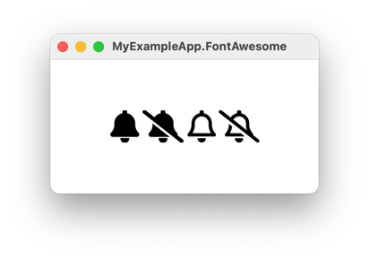

# How to use Font Awesome with AvaloniaUI

You prolly already read the docs.
If not, [go do that now.](https://github.com/djeikyb/AvaloniaWithFontAwesome)

## 1. The first gotcha

What you absolutely must understand to avoid quite a bad headache, is to not
gloss over the `YourDotnetAssemblyName` in the `avares://` uri. I knew the tip
of my left elbow more intimately than Avalonia resources, and thus I acquired a
headache while struggling to use a custom font.

What assembly is your font directory in?
The avares uri must start with that assembly name!

```xml
<Application.Resources>
    <FontFamily x:Key="SomeFontKey">avares://YourDotnetAssemblyName/Assets/Fonts#Font Awesome 6 Free</FontFamily>
</Application.Resources>
```

In fact, every `avares://` uri _must_ start with an assembly name. This sample
project names the csproj file path different than the assembly name to prove the
point. [An avares](https://docs.avaloniaui.net/docs/basics/user-interface/assets)
is more like a dotnet EmbeddedResource than a file path.

## 2. The second gotcha

The `avares://` uri is structured like:

```
avares://AssemblyName/Path/In/TheAssembly#The Official Font Identifier
```

In this project:

```
avares://YourDotnetAssemblyName/Assets/Fonts#Font Awesome 6 Free
         |______assembly______| |___Path___| |_Font Identifier_|
```

You have to know the right Font Identifier. This should be the font's family
name as advertised by whoever made the font. But that might not be the case! 
The font itself has the correct family name as part of its data. On macOS, the
Font Book app can tell you the family name. [And there are other ways.](https://stackoverflow.com/a/72228817/659715)

## 3. Format some text

Now you can use the FontFamily `x:Key` name to reference the font, like:

```xml
<TextBlock Text="&#xf0f3;"
           FontFamily="{StaticResource SomeFontKey}"
           FontWeight="Bold" />
<TextBlock Text="&#xf1f6;"
           FontFamily="{StaticResource SomeFontKey}"
           FontWeight="Bold" />
<TextBlock Text="&#xf0f3;"
           FontFamily="{StaticResource SomeFontKey}" />
<TextBlock Text="&#xf1f6;"
           FontFamily="{StaticResource SomeFontKey}" />
```

### 4. Run the app

```
dotnet publish -c Release
./artifacts/publish/Example/release/YourDotnetAssemblyName
```



Links:

- https://avaloniaui.net/blog/elevate-your-application-s-ui-with-custom-fonts
- https://docs.avaloniaui.net/docs/guides/styles-and-resources/how-to-use-fonts
- https://docs.avaloniaui.net/docs/basics/user-interface/assets
- https://fontawesome.com/download
